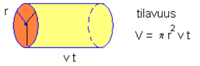

# Mekaaninen energia

Kun kappaleen siirtämiseksi on tehty työtä, niin kappale on saanut kyseistä työtä vastaavan määrän energiaa. Kappaleen mekaaninen energia $E$ koostuu potentiaalienergiasta $E_p$ ja liike-energiasta $E_k$ (alaindeksi k tulee sanasta "kineettinen"). Yhteensä mekaaninen energia on 

$E=E_p+E_k$.

Potentiaalienergia on peräisin nostotyöhön käytetystä energiasta, joten se  määritellään $E_p=mgh$, missä $m$ on kappaleen massa, $g=9.81~\frac{\text{m}}{\text{s}^2}$ on Maan aiheuttama putoamiskiihtyvyys ja $h$ kappaleen sijaintikorkeus sovitusta nollatasosta. Nollatasoksi voidaan valita esimerkiksi merenpinta tai lattian taso. 

Laajemmin ajateltuna potentiaalienergiaksi lasketaan kaikki sellaiset energiamuodot, joista energia voi myöhemmin vapautua. Esimerkiksi jousiammunnassa jännitetyssä jousessa on potentiaalienergiaa, joka voidaan vapauttaa ja muuntaa nuolen liikkeeksi. Potentiaalienergiaa on myös jäniksen tai sammakon jaloissa, kun se valmistautuu isoon loikkaan.

**Esim.** Omena, jonka massa on 100 g, sisältää kemiallista energiaa noin 135 000 J. Kuinka korkealle se voitaisiin nostaa tällä energiamäärällä?

:::{admonition} Ratkaisu
:class: tip, dropdown

Ratkaistaan korkeus yhtälöstä $E_p=mgh$, siis $h=\frac{E_p}{mg}$ ja sijoitetaan luvut:

$h=\frac{135000~\text{J}}{0.1~\text{kg}~\cdot 9.81~\frac{\text{m}}{\text{s}^2}} = 137~\text{km}$

:::

Liike-energia määritellään $E_k=\frac{1}{2} mv^2$, missä m on kappaleen massa (kg) ja v kappaleen nopeus (m/s).

:::{admonition} Perustelu
:class: tip, dropdown

Liike-energiakin on peräisin kappaleeseen tehdystä työstä $W$. Työ on määritelmän mukaan $W=Fs$, ja edelleen Newtonin 2. lain mukaan voima voidaan esittää massan $m$ ja kiihtyvyyden $a$ avulla. Kuljettu matka $s$ taas saadaan kiihtyvän liikkeen laskukaavoilla: $s=\frac{1}{2}at^2$. Siis työ, jolla kappale on saatu liikkumaan tietyllä kiihtyvyydellä, on

$W=Fs=ma \cdot \frac{1}{2} at^2$.

Tämä voidaan sieventää muotoon $W=\frac{1}{2}m(at)^2$ ja kun kiihtyvän liikkeen kaavoista muistetaan, että loppunopeus ajan $t$ kestäneen kiihdytyksen jälkeen on $v=at$, niin työn määrä saadaan esitettyä muodossa

$W=\frac{1}{2} mv^2$.

:::

**Esim.** Auto, jonka massa on 1500 kg, kiihdyttää levosta nopeuteen 90 km/h. Paljonko autolla on liike-energiaa kiihdytyksen jälkeen?

:::{admonition} Ratkaisu
:class: tip, dropdown

$E_k=\frac{1}{2} \cdot 1500~\text{kg} \cdot \left(\frac{90}{3.6}~\frac{\text{m}}{\text{s}} \right)^2 = 470~\text{kJ}$

:::

## Energiantuotanto

Voimalaitoksissa "tuotetaan" energiaa eli muutetaan saatavilla olevia energiamuotoja sähköenergiaksi. Useimmissa voimalatyypeissä ilman, veden tai höyryn mekaanista energiaa käytetään turbiinien pyörittämiseen. Turbiineissa on kestomagneetti, jonka pyörimisliike aiheuttaa sitä ympäröivään sähköjohtimeen sähkövirran.

Saatua tehoa kuvaa antoteho $P_{\text{anto}}=\eta P_{\text{otto}}$.

Vesivoimalassa ottoteho on peräisin putoavan veden potentiaalienergiasta:

$P_{\text{otto}}=\frac{mgh}{t}$, joten antoteholle muodostuu lauseke $P_{\text{atto}}=\frac{\eta mgh}{t}$

Kaavassa $m$ on ajassa $t$ putoavan vesimäärän massa ja $h$ vesiputouksen korkeus. Veden massa voidaan ilmaista myös veden tiheyden $\rho=1000~\frac{\text{kg}}{\text{m}^3}$ ja tilavuusvirran $V$, eli sekunnissa virtaavan vesimäärän tilavuuden, tulona.

**Esim.** Petäjäskosken voimalan vesipintojen korkeusero on 20 m. Laske sen tuottama sähköteho, kun juoksutus turbiinien läpi on 700 kuutiometriä sekunnissa ja hyötysuhde on 0.92. Kuutiometri vettä painaa 1000 kg.

:::{admonition} Ratkaisu
:class: tip, dropdown

$P_{\text{anto}}=\eta \cdot \frac{mgh}{t} = 0.92 \cdot \frac{\rho V g h}{t} = 0.92 \cdot \frac{1000~\frac{\text{kg}}{\text{m}^3} \cdot 700~\text{m}^3 \cdot 9.81~\frac{\text{m}}{\text{s}^2} \cdot 20~\text{m}}{1~\text{s}} = 126~\text{MW}$

:::

Tuulivoimalassa hyödynnetään ilman liike-energiaa. Tuulivoimalan tuottama sähköteho on $P_{\text{anto}}=\frac{1}{2} \eta \rho \pi r^2 v^3$, missä $\rho=1.25~\frac{\text{kg}}{\text{m}^3}$ on ilman tiheys, $r$ roottorin siivekkeen pituus ja $v$ tuulen nopeus. 

:::{admonition} Perustelu
:class: tip, dropdown

Roottorin siivekkeiden läpi tietyssä ajassa kulkevalla ilmalla on liike-energiaa $\frac{1}{2}mv^2$, missä $m$ on kyseisen ilmamäärän massa. Kun massa ilmaistaan tiheyden ja tilavuuden avulla, niin liike-energiaksi tulee $\frac{1}{2}\rho V v^2$. Ilmaa virtaa roottorin läpi ajassa $t$ tilavuus $V=\pi r^2 vt$. 

Kun sijoitetaan tilavuuden laskukaava liike-energian lausekkeeseen, saadaan liike-energiaksi $\frac{1}{2}\rho \pi r^2 vt v^2$ eli $\frac{1}{2}\rho \pi r^2 v^3 t$. Sähkötehon laskemiseksi kerrotaan energiamäärä hyötysuhteella $\eta$ ja jaetaan vielä ajalla $t$, joka tarkastellulta ilmamäärältä kului siivekkeiden kautta kulkemiseen:

$P_{\text{anto}}=\frac{\frac{1}{2} \eta \rho \pi r^2 v^3 t}{t} = \frac{1}{2} \eta \rho \pi r^2 v^3$.

:::

**Esim.** Laske tuulivoiman tuottama sähköteho, kun siiven pituus on 45 m ja hyötysuhde 0.40. Tuulen nopeus on 12 m/s.

:::{admonition} Ratkaisu
:class: tip, dropdown

$P_{\text{anto}}=\frac{1}{2}\cdot 0.40\cdot 1.25~\frac{\text{kg}}{\text{m}^3}\cdot \pi \cdot (45~\text{m})^2 \cdot \left(12~\frac{\text{m}}{\text{s}}\right)^3 = 2.7~\text{MW}$

:::