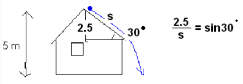

# Energian säilyminen

Aiemmin ollaan jo todettu, että energia ei häviä, mutta voi muuttaa muotoaan. Tarkastellaan tässä muodonmuutoksia potentiaalienergian ja kineettisen energian välillä, eli toisin sanoen mekaanisen energian säilymistä. Mekaanisen energian säilyminen on helppo havaita: kun esimerkiksi pallo vierii mäkeä alas, sillä on sitä enemmän vauhtia, mitä alemmaksi se on ehtinyt. Mäen päällä sillä on ollut potentiaalienergiaa, ja mäen alla sillä on saman verran energiaa, mutta liike-energian muodossa.

Hieman monimutkaisempi tilanne on silloin, kun kappaleisiin vaikuttaa matkan varrella kitka, ilmanvastus tai muu vastaava voima. Tällöin esimerkiksi mäen alle päätyneellä pulkkailijalla ei ole jäljellä aivan yhtä verran energiaa liike-energiana kuin sitä oli ylhäällä potentiaalienergian muodossa. Tällaisia tilanteita käsitellään yleisen energiaperiaatteen avulla. Kumpaakin tapausta voi kokeilla [simulaattorissa](https://phet.colorado.edu/sims/html/energy-skate-park-basics/latest/energy-skate-park-basics_en.html).

## Mekaanisen energian säilymislaki

Oletetaan, että kappale, jonka massa on $m$, liikkuu korkeudella $h_1$ ja nopeudella $v_1$. Se voi olla esimerkiksi ilmassa putoamassa alaspäin, liukumassa kitkatonta mäkeä alas, tai ilmaan heitettynä matkalla ylöspäin. Tällöin kappaleen mekaaninen energia on

$E=\frac{1}{2} m v_1^2+mgh_1$ 

Jos kappaleeseen ei kohdistu painovoiman lisäksi muita voimia, niin kappaleen mekaaninen energia säilyy vakiona. Käytännössä tämä usein ilmenee siten, että kun kappale siirtyy uudelle korkeudelle $h_2$, sen nopeus saa uuden arvon $v_2$. Esimerkiksi jos pesäpallon heittää pystysuoraan ylöspäin, niin sen liike hidastuu sitä mukaa kun se nousee. Vastaavasti jos pulkalla lasketaan lähes kitkatonta mäkeä, jossa vauhti kiihtyy koko ajan, niin nopeus alempana mäessä on suurempi kuin ylempänä. Laskukaavana tämä voidaan ilmaista mekaanisen energian säilymislakina:

$\frac{1}{2} mv_1^2+mgh_1=\frac{1}{2} mv_2^2+mgh_2$

Jakamalla yhtälön molemmat puolet massalla mekaanisen energian säilymislaki saadaan muotoon

$\frac{1}{2} v_1^2+gh_1=\frac{1}{2} v_2^2+gh_2$

Mekaanisen energian säilymislain avulla voidaan ratkaista samanlaisia ongelmia kuin pystysuoran kiihtyvän liikkeen kaavoilla.

::::{admonition} Esimerkki

a) Kivi pudotetaan 30 metrin korkeudesta. Millä nopeudella se osuu maahan?

b) Millä nopeudella kivi osuu maahan, jos sillä onkin 30 metrin korkeudella lähtönopeus 5 m/s ?

:::{admonition} Ratkaisu
:class: tip, dropdown

a) Mekaanisen energian säilymislakiin voidaan sijoittaa $v_1=0~\text{m/s}$ ja $h_2=0~\text{m}$, jolloin se sievenee muotoon

$gh_1=\frac{1}{2} v_2^2$

Tästä ratkeaa $v_2=\sqrt{2gh_1} = \sqrt{2\cdot 9.81~\frac{\text{m}}{\text{s}^2} \cdot 30~\text{m}} = 24.3~\text{m/s}$

b) Sijoittamalla $h_2=0~\text{m}$ yhtälö sievenee muotoon $\frac{1}{2} v_1^2+gh_1=\frac{1}{2} v_2^2$, josta voidaan ratkaista 

$v_2=\sqrt{v_1^2+2gh_1}=\sqrt{(5~\text{m/s})^2+2\cdot 9.81~\frac{\text{m}}{\text{s}^2} \cdot 30~\text{m}} = 24.8~\text{m/s}$

:::

::::

## Yleinen energiaperiaate

Oletetaan, että äskeiseen kappaleeseen kohdistuu työ $W$. Tällöin kappaleen mekaanisen energian määrä muuttuu arvon $W$ verran. Tämä voidaan esittää yleisen energiaperiaatteen avulla:

$\frac{1}{2} mv_1^2+mgh_1+W=\frac{1}{2} mv_2^2+mgh_2$

Työ $W$ voi olla esimerkiksi kitkavoiman tekemää työtä, jolloin $W=-\mu mgx$, missä $x$ on kappaleen kulkema matka ja $\mu$ kitkakerroin, tai $W=-μmg \cos{\alpha} x$, jos kappale on tasolla, jonka kaltevuuskulma on $\alpha$. Yleisen energiaperiaatteen avulla voidaan ratkaista samanlaisia ongelmia kuin kiihtyvän liikkeen kaavoilla, esimerkiksi jarrutusmatkoja pysähdykseen asti, tai nopeuksia tietyn jarrutusmatkan jälkeen.

::::{admonition} Esimerkki

a) Laske yleisen energiaperiaatteen avulla auton jarrutusmatka pysähdykseen asti tasaisella tiellä nopeudesta 90 km/h (=25 m/s), kun jarrutuksen aiheuttaa liukukitka kitkakertoimella $\mu=0.50$.

b) Mikä on auton nopeus 40 metrin jarrutuksen jälkeen?

:::{admonition} Ratkaisu
:class: tip, dropdown

a) Koska tie on tasainen, voidaan heti asettaa $h_1=h_2=0~\text{m}$. Yleisestä energiaperiaatteesta jää jäljelle

$\frac{1}{2}mv_1^2+W=\frac{1}{2}mv_2^2$.

Lisäksi loppunopeuden pitää olla $v_2=0~\text{m/s}$, joten energiaperiaatteesta muodostuu

$\frac{1}{2}mv_1^2+W=0$.

Sijoitetaan kitkatyön paikalle $W=-\mu gx$ ja ratkaistaan kysytty matka $x$:

$\frac{1}{2}mv_1^2-\mu mgx=0$

$\frac{1}{2}v_1^2-\mu gx=0$

$x=\frac{v_1^2}{2 \mu g} = \frac{(25~\text{m/s})^2}{2\cdot 0.5 \cdot 9.81~\frac{\text{m}}{\text{s}^2}} = 64~\text{m}$.

WolframAlphalla sopiva komento olisi: solve 1/2\*(90/3.6)^2-0.5\*9.81*x=0

b) Nyt loppunopeus ei ole nolla, joten energiaperiaatteeksi tulee

$\frac{1}{2}mv_1^2-\mu mgx =\frac{1}{2}mv_2^2$

ja edelleen

$\frac{1}{2}v_1^2-\mu gx =\frac{1}{2}v_2^2$,

josta ratkeaa

$v_2=\sqrt{v_1^2-2 \mu g x}$

$v_2 = \sqrt{(25~\text{m/s})^2-2\cdot 0.5\cdot 9.81~\frac{\text{m}}{\text{s}^2} \cdot 30~\text{m}} = 18.2~\text{m/s}$ eli noin 66 km/h.

WolframAlphalla laskun voisi suorittaa komennolla: solve 1/2\*25^2-0.5\*9.81\*30=1/2\*v^2

:::

::::

::::{admonition} Esimserkki

Puupalikka liukuu 5 m korkean talon katolta ensin räystäälle ja putoaa sitten alas. Räystään korkeus on 2.5 m ja katon kaltevuuskulma 30 astetta. Laske nopeus, jolla palikka putoaa maahan

a) jos katto on jäinen (kitkakerroin on likimain 0), 

b) jos kitkakerroin katon ja palikan välillä on 0.30.

:::{admonition} Ratkaisu
:class: tip, dropdown

a) Koska kitkatyötä ei ole, niin palikan potentiaalienergia katolla muuttuu kokonaan sen liike-energiaksi maahan osumisen hetkellä. Sijoitetaan energian säilymislakiin tunnetut lukuarvot $v_1=0~\text{m/s}$ ja $h_2=0~\text{m}$ ja ratkaistaan loppunopeus $v_2$:

$gh_1 = \frac{1}{2}v_2^2$

$v_2=\sqrt{2 gh_1} = \sqrt{2\cdot 9.81~\frac{\text{m}}{\text{s}^2} \cdot 5~\text{m}} = 9.9~\text{m/s}$

b) Kitkatyö vaikuttaa palikkaan katolla matkan $s$, joka saadaan selville trigonometrian avulla:
 
$s=\frac{2.5~\text{m}}{\sin⁡{30^{\circ}}} = 5~\text{m}$

Nyt kitkan tekemä työ on $W=-μmg \cos{30^{\circ}}$. 

Yleisen energiaperiaatteen mukaan 

$mgh_1-\mu mg \cos{⁡30^{\circ}} s=\frac{1}{2} mv_2^2$

ja edelleen

$gh_1-\mu g \cos{⁡30^{\circ}} s=\frac{1}{2} v_2^2$,

josta saadaan tulos

$v_2 = \sqrt{2 gh_1-2\mu g \cos{⁡30^{\circ}} s} = \sqrt{2g(h_1-\mu \cos{⁡30^{\circ}} s)} $ 

$v_2 = \sqrt{2\cdot 9.81~\frac{\text{m}}{\text{s}^2} \cdot (5~\text{m}-0.30\cos{30^{\circ}}\cdot 5~\text{m})} = 8.5~\text{m/s}$

WolframAlphaan yhtälön voisi kirjoittaa seuraavasti: solve s=2.5/sin(30), 9.81\*5-0.3\*9.81*cos(30)\*s=0.5\*v^2

:::

::::

::::{admonition} Esimerkki

Pientä punnusta pyöritetään 80 cm pitkän köyden avulla siten, että punnus liikkuu pystysuunnassa ympyränmuotoisella radalla. Kuinka suuri täytyy punnuksen nopeuden olla ympyrän matalimmassa kohdassa, jotta kyseinen liike olisi mahdollista?
 
 

:::{admonition} Ratkaisu
:class: tip, dropdown

Ympyräliikkeestä muistetaan, että ylimmässä pisteessä keskipakovoiman tulee olla yhtä suuri kuin kappaleeseen kohdistuvan painovoiman, siis 

$mg=\frac{mv_2^2}{r}$, josta saadaan $v_2=\sqrt{rg}$, missä $r$ on köyden pituus.

Lisäksi voidaan valita alimman pisteen korkeudeksi nolla, siis $h_1=0~\text{m}$ ja $h_2=1.60~\text{m}$ eli ympyrän halkaisijan pituus.

Sijoitetaan $h_1=0~\text{m}$ ja edellä laskettu $v_2$ mekaanisen energian säilymislakiin:

$\frac{1}{2} v_1^2=\frac{1}{2} (\sqrt{rg})^2+gh_2$

$\frac{1}{2} v_1^2=\frac{rg}{2} rg + gh_2$

$v_1=\sqrt{rg+2gh_2}$

$v_1=\sqrt{0.80~\text{m}\cdot 9.81~\frac{\text{m}}{\text{s}^2} + 2 \cdot 9.81~\frac{\text{m}}{\text{s}^2} \cdot 1.60~\text{m}} = 6.3~\text{m/s}$.

WolframAlpha: solve v2^2/0.8=9.81, 0.5\*v1^2=0.5\*v2^2+9.81\*1.6
 
:::

::::

::::{admonition} Esimerkki

Huvipuistossa on vuoristorata, jolla vaunu liukuu kitkattomasti korkeudelta $h$ alas ja tekee silmukan, jonka säde on $R$. Kuinka korkealta vaunun on lähdettävä silmukan säteeseen verrattuna?

:::{admonition} Ratkaisu
:class: tip, dropdown

Pisteessä P tulee taas olla voimassa $mg=\frac{mv_2^2}{R}$, josta saadaan $v_2=\sqrt{Rg}$.

Energiaperiaatteen mukaan vaunun potentiaalienergia lähtöpisteessä on sama kuin vaunun mekaaninen energia pisteessä P. Tässä pisteessä korkeus on $2R$.

$mgh=\frac{1}{2} mv^2+mg\cdot 2R$

$mgh=\frac{1}{2} m(\sqrt{gR})^2+2mgR$

$gh=\frac{1}{2} (\sqrt{gR})^2+2gR$

$gh=\frac{1}{2} gR +2gR$

$h=\frac{1}{2} R +2R$

$h=2.5 R$

:::

::::