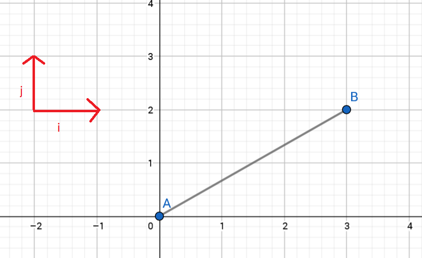
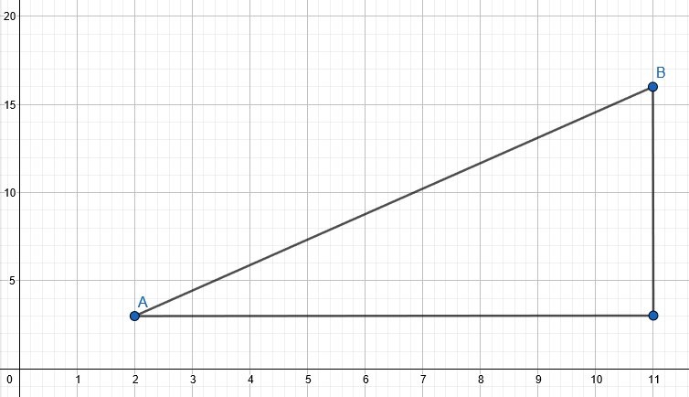

# Paikka- ja nopeusvektorit

Kappaleen sijainti voidaan esittää kätevästi paikkavektorilla, joka sisältää kaksi tai kolme erisuuntaista komponenttia (esim. eteen-taakse, oikealle-vasemmalle, tai itä-länsi, pohjois-etelä, ylös-alas –suunnat). Näitä suuntia merkitään usein lihavoiduilla **i**-, **j**- ja **k**-kirjaimilla. Paikkavektori on summa näistä suunnista eri kertoimilla varustettuna. Vektoreita merkitään jollakin lihavoidulla kirjaimella tai kirjainyhdistelmällä. Esimerkiksi alla olevassa kuvassa kappaleen sijaintia pisteessä B kuvaa pisteestä A pisteeseen B johtava vektori **AB**=3**i** + 2**j**. 

Myös nopeus on vektorisuure, eli sillä on suuruus ja suunta. Kappale voi siis liikkua yhtä aikaa useampaankin kuin yhteen suuntaan. Suuntien etumerkit valitaan tilanteen mukaan, usein suunta alaspäin määritellään negatiiviseksi.

Keskinopeusvektori **v** määritellään: $\mathbf{v}= \frac{\Delta \mathbf{r}}{\Delta t}$ missä r on kappaleen paikkaa kuvaava vektori. Muutos pitää siis laskea kaikki eri suunnat huomioiden, ja nopeuskin sisältää eri suuntaisia osia. Muutoksen laskussa **i**:n kertoimet vähennetään toisistaan, **j**:n kertoimet toisistaan ja **k**:n kertoimet toisistaan. Tällaista vektorilaskentaa käsitellään enemmän lineaarialgebran opintojaksolla.

Nopeuden suuruutta eli nopeusvektorin itseisarvoa sanotaan vauhdiksi ja merkitään $v$. Se lasketaan:

$v=\sqrt{(\text{i:n kerroin})^2+(\text{j:n kerroin})^2+(\text{k:n kerroin})^2}$

**Esim.** Lintu lentää siten, että se siirtyy joka sekunti 10 cm itään, 20 cm pohjoiseen ja 5 cm alaspäin. 

Sen nopeusvektori siten, että yksiköksi on valittu metri, on 0.1 **i**+0.2 **j**-0.05 **k**, ja vauhti on 

$v=\sqrt{(0.1~\text{m/s})^2+(0.2~\text{m/s})^2+(-0.05~\text{m/s})^2}=0.23~\text{m/s}$.
 

**Esim.** Kappale sijaitsee hetkellä t=1 s paikassa A, jota kuvaa vektori $\mathbf{r}_1=2~\mathbf{i}+3~\mathbf{j}$. Hetkellä t=4 s kappaleen sijainti B on $\mathbf{r}_2=11~\mathbf{i}+16~\mathbf{j}$.
 
Kappaleen keskinopeus:

$\mathbf{v}=\frac{\mathbf{r}_2-\mathbf{r}_1}{4~\text{s}-1~\text{s}}=\frac{(11-2)~\mathbf{i}+(16-3)~\mathbf{j}}{3~\text{s}} = \frac{9~\mathbf{i}+13~\mathbf{j}}{3~\text{s}} = 3~\frac{\mathbf{i}}{\text{s}} + 4.3~\frac{\mathbf{j}}{\text{s}}$

Kappaleen vauhti oli $v=\sqrt{3^2+4.3^2}=5.24$ yksikköä sekunnissa.
