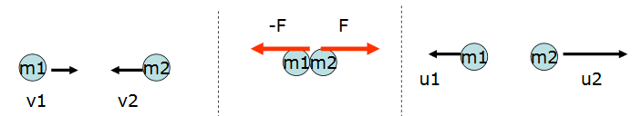

# Liikemäärä

Liikemäärän käsitettä tarvitaan, kun tarkastellaan tilanteita joissa kaksi tai useampi kappaletta törmäävät toisiinsa. Törmäys voi tapahtua liikkuvien kohteiden välillä, esimerkiksi autot voivat risteyksessä kolhia toisiaan, tai liikkuva kohde voi törmätä paikallaan olevaan kohteeseen, esimerkiksi kun paikallaan olevaa jalkapalloa potkaistaan. Esitellään seuraavaksi aiheeseen liittyvät peruskäsitteet:

- Kappaleen massan $m$ ja nopeuden $v$ tuloa sanotaan liikemääräksi, $p=mv$.

- Jos kappaleeseen vaikuttaa hetken $\Delta t$ ajan jokin voima $F$, niin voiman suuruuden ja voiman vaikutusajan tuloa sanotaan impulssiksi, $I=F \Delta t$.

Edellisistä määritelmistä voidaan johtaa impulssiperiaate: $F \Delta t=\Delta(mv)$. Siis kun kappaleeseen vaikuttaa tietyn ajan jokin voima, niin kappaleen liikemäärä muuttuu. 

Jos kappaleen massa ei muutu voiman vaikutuksen takia, niin liikemäärän muutos johtuu pelkästään nopeuden muutoksesta ja tällöin voidaan kirjoittaa $F\Delta t=m \Delta v$.

**Esim.** Pesäpallo (m=150 g) saa lyönnissä nopeuden 100 km/h. Jos maila osuu palloon 0.05 sekunnin ajan, niin kuinka suuren voiman se kohdistaa palloon?
:::{admonition} Ratkaisu
:class: tip, dropdown

$F=\frac{m \Delta v}{\Delta t}=\frac{0.150~\text{kg}\cdot \frac{100}{3.6}~\frac{\text{m}}{\text{s}}}{0.05~\text{s}} = 83~\text{N}$

:::

Impulssiperiaatetta sovelletaan tilanteisiin, joissa kaksi kappaletta (massat $m_1$ ja $m_2$) liikkuvat nopeuksilla $v_1$ ja $v_2$ ja törmäävät toisiinsa suoraviivaisesti. Törmäyksessä kumpaankin kappaleeseen vaikuttaa Newtonin 3. lain mukaisesti vastakkaissuuntainen, mutta saman suuruinen voima $F$.

Jos oletetaan, että kummankaan kappaleen massa ei muutu, niin impulssiperiaatteesta saadaan johdettua liikemäärän säilymislaki:

$m_1 v_1+m_2 v_2=m_1 u_1+m_2 u_2$,

missä $u_1$ ja $u_2$ ovat kappaleiden nopeudet törmäyksen jälkeen. Kahden kappaleen muodostaman systeemin kokonaisliikemäärä siis säilyy törmäyksessä.

Liikemäärän säilymislakia ja erilaisia törmäyksiä voi tutkia [Collision Lab](https://phet.colorado.edu/en/simulations/collision-lab) -sovelluksessa. Seuraavassa luvussa opetellaan tarkastelemaan törmäyksiä laskennallisesti. Collision Lab -simulaatio perustuu juuri samoihin laskukaavoihin.