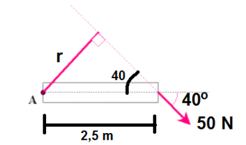
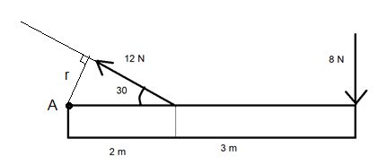

# Voiman momentti

Voiman momentilla on merkitystä, kun tarkastellaan esimerkiksi sillan tukirakenteisiin kohdistuvia kuormituksia, kun eri painoisia ajoneuvoa on eri kohdissa siltaa. Momenttien avulla voidaan myös laskea, millä ehdoilla tikkaat tai rakennustelineet pysyvät pystyssä. Momentteja tarvitaan myös geofysiikassa: Auringon ja maan välisellä painovoimalla on momentti, joka muuttaa maapallon asentoa jaksollisesti.

Voiman $F$ momentiksi $M$ kutsutaan kyseisen voiman suuruuden ja "voiman varren" $r$ tuloa, $M=Fr$.

Voiman varsi $r$ on voiman vaikutussuoran kohtisuora etäisyys ns. momenttiakselipisteestä. Se on piste, jonka ympäri kappaleen voitaisiin ajatella lähtevän kiertymään. Sopivan pisteen valinta riippuu tilanteesta. Etäisyyksien laskemisessa hyödynnetään tarvittaessa suorakulmaisen kolmion trigonometriaa.

Voiman suunnasta riippuen momentti saa positiivisen tai negatiivisen arvon. Momentin seurauksena kappale lähtee pyörähtämään:
- vastapäivään, jos $M > 0$ 
- myötäpäivään, jos $M < 0$

Se, millä tavalla kappale lähtee pyörähtämään, riippuu kappaleesta. Momentti $M$ aiheuttaa kappaleelle, jonka hitausmomentti on $J$, kulmakiihtyvyyden $\alpha$ seuraavasti: $M=J\alpha$. Kulmakiihtyvyys taas määritellään kulmataajuuden muutoksena ajan muuttuessa: $\alpha = \frac{\Delta \omega}{\Delta t}$. Jos kappaleen hitausmomentti on suuri, se saa tietyn suuruisesta momentista pienen kulmakiihtyvyyden eli lähtee pyörimään hitaasti.

Jos kappaleeseen vaikuttaa useita voimia, lasketaan kokonaismomentti yksittäisten momenttin summana, voimien suunnat huomioiden. Vertaa tilannetta Newtonin 2. lakiin $F=ma$: mitä suurempi on kappaleen massa, sitä pienemmän kiihtyvyyden se saa, kun siihen kohdistuu tietyn suuruinen kokonaisvoima. 

**Esim.** 50 N voima vaikuttaa 2.5 m pitkään tankoon 40 asteen kulmassa alaspäin. Mikä on voiman momentti kiinnityspisteen A suhteen?
 

:::{admonition} Ratkaisu
:class: tip, dropdown

Kuvaan on täydennetty voiman jatke siten, että voimavektoria on jatkettu niin pitkälle, että voidaan piirtää kohtisuora etäisyys pisteeseen A. Suorakulmaisen kolmion trigonometrian perusteella

$\sin{40^{\circ}} = \frac{r}{2.5~\text{m}}$, joten 

$r=2.5~\text{m}\cdot \sin{40^{\circ}} = 1.61~\text{m}$.

Momentti on $M=50~\text{N}\cdot 1.61~\text{m}=80.5~\text{Nm}$. 

Momentti on positiivinen. Jos kappaletta vedettäisiin voimanuolen suunnassa, se lähtisi kiertymään pisteen A ympäri vastapäivään.

:::

**Esim.** Laske momentti pisteen A suhteen kuvan kappaleelle:

:::{admonition} Ratkaisu
:class: tip, dropdown

Oikeassa reunassa oleva voima on kohtisuorassa pisteeseen A suuntautuvaa suoraa vastaan. Niinpä se aiheuttaa momentin

$M_1=-8~\text{N}\cdot 5~\text{m} = -40~\text{Nm}$.

Toiselle voimalle lasketaan etäisyys seuraavasti:

$r=2~\text{m}\cdot\sin{30^{\circ}}$,

jolloin voima aiheuttaa momentin

$M_2=12~\text{N}\cdot 2~\text{m}\cdot\sin{30^{\circ}} = 12 ~\text{Nm}$.

Kokonaismomentti on

$M=M_1+M_2=-28~\text{Nm}$.

:::

Eräs momentin sovellus on kaksivartinen vipu. Sellaisia käytetään mm. hydraulisissa laitteissa. Käytännössä myös tavallinen rautakanki voi toimia kaksivartisena vipuna. Fysiikan termein ilmaistuna se kone, jossa hyödynnetään momenttia tukipisteen suhteen.

Kaksivartiselle vivulle pätee: $Qr_2=Fr_1$ eli kuorma $Q$ saadaan nostettua voimalla $F$, jonka suuruus riippuu kuorman ja voiman etäisyyksistä $r_1$ ja $r_2$ tukipisteestä mitattuna.

**Esim.** Kaksivartisella vivulla yritetään nostaa 100 kg kuormaa. Vivun alla on tuki 25 cm päässä kuormasta. Kuinka pitkä on vivun oltava, jotta nostamiseen riittää 250 N voima?

:::{admonition} Ratkaisu
:class: tip, dropdown

Ratkaistaan vipuvarsi $r_1$ yhtälöstä $Qr_2=Fr_1$: 

$r_1=\frac{Q}{F} r_2$

Kuorman paino on $Q=100~\text{kg}\cdot 9.81 ~\frac{\text{m}}{\text{s}^2}$.

Sijoittamalla tämän lisäksi voima $F=250~\text{N}$ ja etäisyys $r_2=0.25~\text{m}$ saadaan

$r_1=\frac{100~\text{kg}\cdot 9.81 ~\frac{\text{m}}{\text{s}^2}}{250~\text{N}} \cdot 0.25~\text{m} = 0.98~\text{m}$.

Koko vivun pituus olisi 0.25 m + 0.981 m = 1.231 m, eli noin 125 cm vipu riittäisi.

:::