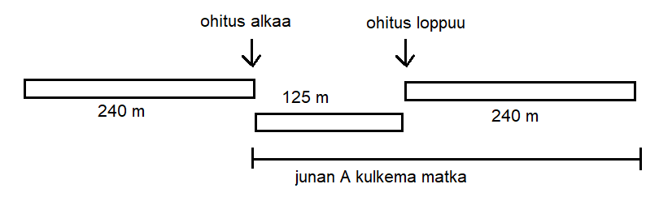

# Suhteellinen nopeus 

Liikumme koko ajan Maapallon mukana Auringon ympäri noin 30 km/s. Voimme mennä liikkuvaan junaan ja istua siellä paikallaan, mutta myös kävellä junan käytävällä. Joka tilanteessa nopeutemme on erilainen suhteessa Aurinkoon, puuhun, junan lattiaan...

Kappaleen nopeutta tarkastellaan yleensä maanpinnan suhteen tai sitten jonkun toisen kappaleen suhteen. Merkitään kappaleen A nopeutta maanpinnan suhteen $v_{AM}$ ja kappaleen B nopeutta maanpinnan suhteen $v_{BM}$. Kappaleen A nopeus kappaleen B suhteen on $v_{AB}$. Nopeuksille pätee yhtälö

$v_{AM}=v_{AB}+v_{BM}$.

Nopeuksien suunnille pitää olla valittuna merkit. Voidaan esimerkiksi ajatella, että vasemmalta oikealle on positiivista nopeutta. Oikealta vasemmalle ajaminen olisi silloin negatiivista, vaikka auto ei varsinaisesti peruuttaisikaan. 

**Esim.** Auto A ajaa nopeudella 80 km/h ja auto B nopeudella 90 km/h. Autot ajavat peräkkäin. Tällöin kummankin auton nopeus on positiivista. Auton A nopeus auton B suhteen on

$v_{AB}=v_{AM}-v_{BM}=80~\text{km/h}-90~\text{km/h}=-10~\text{km/h}$.

**Esim.** Auto A ajaa nopeudella 80 km/h ja auto B tulee vastakkaista kaistaa pitkin vastaan nopeudella 90 km/h. Tällöin auton A nopeus voidaan valita positiiviseksi ja auton B nopeus negatiiviseksi. Auton A nopeus auton B suhteen on 

$v_{AB}=v_{AM}-v_{BM}=80~\text{km/h}-(-90~\text{km/h})=170~\text{km/h}$.

Suhteellinen nopeus on tärkeä ohitustilanteissa. Kun arvioidaan ohitukseen tarvittavaa aikaa ja matkaa, lasektaan ohitusaika autojen suhteellisen nopeuden avulla. Tarvittava matka taas lasketaan autojen oikeiden nopeuksien avulla.

**Esim.** Kaksi junaa, joiden pituudet ovat 240 m ja 125 m ja vauhdit vastaavasti 140 km/h ja 85 km/h, kulkevat vierekkäisillä raiteilla 
a) samaan suuntaan, b) vastakkaisiin suuntiin. Molemmissa tapauksissa junan A kulkema matka junan B suhteen on 240 m + 125 m = 365 m. Kuinka kauan ohitus kestää?

:::{admonition} Ratkaisu
:class: tip, dropdown

a) Valitaan $v_{AM}=140~\text{km/h}, v_{BM}=85~\text{km/h}$. Tällöin 

$v_{AB}=v_{AM}-v_{BM}$

$v_{AB}=140~\text{km/h}-85~\text{km/h}=55~\text{km/h}=15.3~\text{m/s}$.  

Ohitusaika on $t=\frac{365~\text{m}}{15.3~\text{m/s}}=24~\text{s}$.

Ohituksen aikana juna A liikkuu $\frac{140}{3.6}~\frac{\text{m}}{\text{s}}\cdot 24~\text{s}=933~\text{m}$.

b) Valitaan $v_{AM}=140~\text{km/h}, v_{BM}=-85~\text{km/h}$. Tällöin 

$v_{AB}=140~\text{km/h}-(-85~\text{km/h})=225~\text{km/h}=62.5~\text{m/s}$.  

Ohitusaika on $t=\frac{365~\text{m}}{62.5~\text{m/s}}=5.8~\text{s}$.

Ohituksen aikana juna A liikkuu $\frac{140}{3.6}~\frac{\text{m}}{\text{s}}\cdot 5.8~\text{s}=226~\text{m}$.
