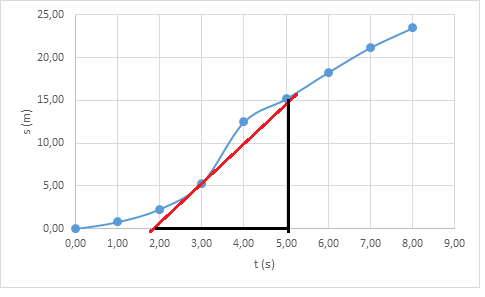

# Suoraviivainen tasainen liike

Suoraviivaisessa liikkeessä kappale liikkuu suoraan yhteen suuntaan. Kappaleen nopeus on ainakin tietyllä aikavälillä sama. Kappaleen paikka eri ajanhetkillä ilmaistaan esimerkiksi $x$-koordinaatilla.
 
Kappaleen keskinopeus $v_k$, jota usein merkitään myös ilman alaindeksiä eli $v$, on kappaleen paikan muutos jaettuna kuluneella ajalla:

$v_k=\frac{\Delta x}{\Delta t} = \frac{x_2-x_1}{t_2-t_1}$.  

Kaavassa merkki $\Delta$ (kreikkalainen kirjain delta) kuvaa yleisesti jonkin suureen arvon muutosta. Jos lähtöhetkeksi valitaan $t_1=0$ s ja lähtöpaikaksi $x_1=0$ m, yhtälö voidaan esittää muodossa 

$v_k=\frac{x}{t}$

eli ilman alaindeksejä, sillä nythän yhtälössä on jäljellä vain yksi matka ja yksi aika, eikä ole tarvettu erottaa eri nopeuksia tai aikoja alaindekseillä.

Nopeuden yksikkö on SI-järjestelmässä $\frac{\text{m}}{\text{s}}$, mutta usein esimerkiksi autoiluun liittyvissä ongelmissa $\frac{\text{km}}{\text{h}}$. Muuntaminen yksiköstä $\frac{\text{km}}{\text{h}}$ yksikköön $\frac{\text{m}}{\text{s}}$ onnistuu kirjoittamalla kilometri metreinä ja tunti sekunteina:

$1~\frac{\text{km}}{\text{h}} = \frac{1000~\text{m}}{3600~\text{s}} = \frac{1000}{3600}~\frac{\text{m}}{\text{s}}=\frac{1}{3.6} ~\frac{\text{m}}{\text{s}}$

**Esim.** $20~\frac{\text{km}}{\text{h}} = 20\cdot \frac{1}{3.6}~\frac{\text{m}}{\text{s}} = \frac{20}{3.6}~\frac{\text{m}}{\text{s}} = 5.6 ~\frac{\text{m}}{\text{s}}$

Edellisestä saadaan ratkaistua myös muunnos toiseen suuntaan: $1~\frac{\text{m}}{\text{s}}=3.6 \frac{\text{m}}{\text{s}}$

**Esim.** $15~\frac{\text{m}}{\text{s}}=15\cdot 3.6~\frac{\text{km}}{\text{h}}=54~\frac{\text{km}}{\text{h}}$

Kaavasta $v=\frac{x}{t}$ voidaan ratkaista mikä tahansa suureista (nopeus, matka tai aika), kun kaksi muuta tunnetaan. Jos matka koostuu osista, joilla keskinopeus vaihtelee, niin koko matkan keskinopeuden laskemiseksi kaavaan pitää laittaa matkaksi kokonaismatka ja ajaksi kokonaisaika. Eri osuuksilla kuluva aika pitää laskea erikseen jokaiselle osuudelle. Erityisesti pätee se, että jos puolet matkasta liikutaan nopeudella $v_1$ ja puolet matkasta nopeudella $v_2$, niin keskinopeus koko matkalla **ei** ole nopeuksien keskiarvo.

**Esim.** Autolla ajetaan ensin 120 km keskinopeudella 85 km/h ja sitten vielä 50 km keskinopeudella 100 km/h. Laske keskinopeus koko matkalla.

:::{admonition} Ratkaisu
:class: tip, dropdown

Nopeuden määritelmä $v=\frac{x}{t}$ voidaan ratkaista aika: $t=\frac{x}{v}$. Lasketaan erikseen eri osuuksille kuluvat ajat:

$t_1=\frac{x_1}{v_1}=\frac{120~\text{km}}{85~\frac{\text{km}}{\text{h}}} = 1.412~\text{h}$

$t_2=\frac{x_2}{v_2}=\frac{50~\text{km}}{100~\frac{\text{km}}{\text{h}}} = 0.5~\text{h}$

Koko matkalla keskinopeus on $v=\frac{x_1+x_2}{t_1+t_2}=\frac{120~\text{km}+50~\text{km}}{1.412~\text{h}+0.5~\text{h}}=88.9~\frac{\text{km}}{\text{h}}$.

:::

## Kuvaajia

Graafinen esitys on usein selkein tapa ilmaista fysiikan sovelluksiin liittyvää tietoa. Liikettä voidaan esittää (aika, paikka) -kuvaajalla tai (aika, nopeus) –kuvaajalla. Merkintä (aika, paikka) tarkoittaa, että kuvaajan vaaka-akselina on aika ja pystyakselina paikka.

Tasaisen liikkeen (aika, paikka) -kuvaajassa keskinopeus on suoran kulmakerroin. Kulmakerroin kertoo yleisesti, kuinka paljon pystyakselin arvot muuttuvat, kun vaaka-akselin arvot muuttuvat tietyn verren.

$v=\frac{\text{matkan muutos}}{\text{ajan muutos}}$

-kuvaaja")

**Esim.** Oheisessa (aika, paikka) -kuvaajassa nopeus, eli suoran kulmakerroin, saadaan esim. ajanhetkien 2 s ja 6 s avulla laskemalla:

$v=\frac{30~\text{m}-10~\text{m}}{6~\text{s}-2~\text{s}}=\frac{20~\text{m}}{4~\text{s}}=5~\frac{\text{m}}{\text{s}}$

Sama tulos saadaan valitsemalla mitkä tahansa muutkin kaksi ajan ja paikan pistettä. 

Jos liike ei ole tasaista, niin (aika, paikka) -kuvaajasta voidaan määrittää hetkellinen nopeus. Se tarkoittaa keskinopeutta hyvin lyhyellä aikavälillä. Hetkellinen nopeus voidaan laskea piirtämällä käyrää sivuava suora ja laskemalla sen kulmakerroin.

**Esim.** Kuvassa hetkellinen nopeus hetkellä $t=3~\text{s}$ on noin $\frac{15~\text{m}}{3~\text{s}}=5~\frac{\text{m}}{\text{s}}$.
 
(Aika, nopeus) –kuvaajasta saadaan kuljettu matka laskemalla nopeuskäyrän ja aika-akselin väliin jäävä pinta-ala. Jos nopeus on tasainen, kuvaaja on vaakasuora viiva, ja matka on $x=v\cdot t$ eli sama kaava joka saadaan myös keskinopeuden määritelmästä.

Jos nopeus muuttuu, nopeuskäyrä voidaan jakaa osiin, joissa nopeus on likimain vakio. Matka saadaan näiden osien ja aika-akselin väliin jäävien alueiden summana. Osien muoto valitaan nopeuskäyrän mukaan.

**Esim.** Seuraava kuva esittää auton nopeutta liikennevalojen välillä. Määritä liikennevaloristeyksien välimatka.

-kuvaajasta")

:::{admonition} Ratkaisu
:class: tip, dropdown
Kokonaismatka on osista laskettujen matkojen summa.

Ensimmäinen kolmio: $s_1=\frac{1}{2} \cdot 5~\text{s}\cdot 15~\text{m/s}=37.5~\text{m}$

Suorakulmio: $s_2=2~\text{s}\cdot 15~\text{m/s}=30~\text{m}$

Puolisuunnikas: $s_3=3~\text{s}\cdot \frac{15~\text{m/s}+12~\text{m/s}}{2} = 40.5~\text{m}$  

Toinen kolmio: $s_4=\frac{1}{2}\cdot 4~\text{s}\cdot 12~\text{m/s}=24~\text{m}$

Yhteensä $s=s_1+s_2+s_3+s_4=132~\text{m}$
:::