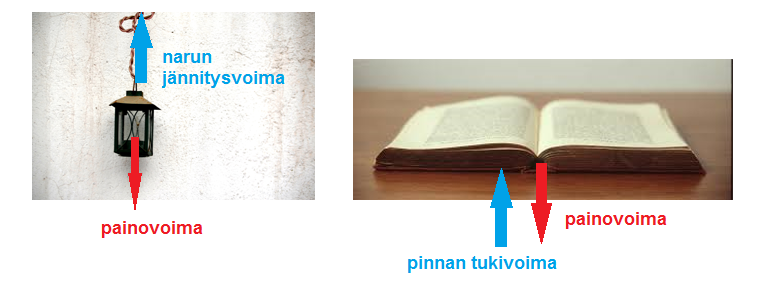
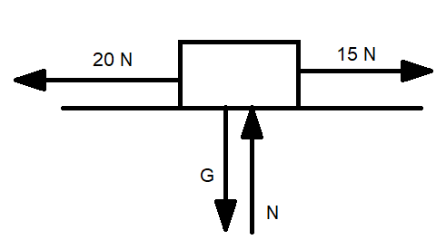
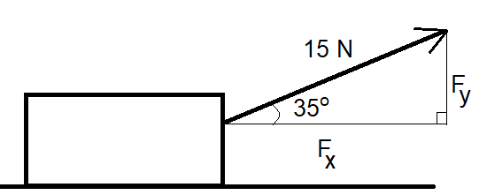

# Peruskäsitteitä

Jokainen kappale on jatkuvasti vuorovaikutuksessa useiden muiden kappaleiden kanssa. Vuorovaikutusta kuvaava suure on nimeltään voima. Sen tunnus on yleensä $F$ (kuten force) ja yksikkö newton, N.

Voimia kuvataan vektoreilla eli "nuolilla", joilla on suunta ja suuruus. Matemaattisesti vektoreita merkitään kirjaimella, jonka yläpuolella on viiva, siis voimavektori olisi $\vec{F}$. Tässä oppimateriaalissa voimista kuitenkin käsitellään vain niiden suuruuksia, ja niiden suunnat huomioidaan hieman eri tavalla kuin vektorimatematiikassa. Tällöin voimia merkitään tavallisilla kirjaimilla.

Kun voimat esitetään tällä tavalla lukuarvoina eikä varsinaisina vektoreina, niin niitä voidaan käsitellä matemaattisesti siten, että pystysuuntaiset voimat lasketaan erikseen, ja vaakasuuntaiset voimat erikseen. Suunnat (ylös-alas, eteen-taakse) huomioidaan etumerkeillä.

Millaisia voimia kappaleisiin sitten vaikuttaa?Jokaiseen kappaleeseen vaikuttaa aina painovoima, joka suuntautuu alaspäin eli Maan keskipistettä kohti. Painovoimaa merkitään yleensä kirjaimella $G$ (gravity). Kappaleeseen vaikuttavan painovoiman suuruutta, eli kappaleen painoa, kuvaa yhtälö 

$G=mg$

missä $m$ on kappaleen massa ja $g$ on putoamisliikkeeseen liittyvä kiihtyvyys $9.81~\frac{\text{m}}{\text{s}^2}$. Laskuihin kappaleen paino laitetaan yleensä miinusmerkkisenä, sillä suunta alaspäin on määritelty negatiiviseksi, kuten kiihtyvän liikkeen tapauksessa.

Usein kappaleeseen vaikuttaa myös jokin painovoimalle vastakkainen voima, esimerkiksi narun jännitysvoima tai lattian tukivoima, joka estää esineen putoamisen. Jännitysvoimia merkitään yleensä kirjaimella $T$ (tension) ja tukivoimia kirjaimella $N$ (normal, normaalivoima eli pintaa vastaan kohtisuora voima). Nämä voimat ovat pystysuuntaisia ja suuntautuvat ylöspäin. Esimerkiksi kun ihminen seisoo lattialla, häneen vaikuttaa painovoima alaspäin ja lattian tukivoima ylöspäin. Jos kappaletta ei erityisesti paineta tai nosteta, vaan se lepää vapaasti vaakasuoralla tasolla, niin tukivoima on yhtä suuri kuin painovoima. Tilanne muuttuu, jos alusta on kalteva, mutta tähän palataan myöhemmin.

Kappaletta saatetaan myös työntää, vetää, painaa tai nostaa jollakin voimalla, ja kappaleen liikkuessa siihen voi vaikuttaa ilmanvastus. Näiden voimien merkki riippuu suunnasta.

Eräs erityisen tärkeä voima on kitka $F_{\mu}$. Se on liikkeelle vastakkainen voima, joten sitä käsitellään laskuissa negatiivisena. Sen suuruus riippuu kappaleen ja sen alustan välisestä kitkakertoimesta $\mu$, joka on yksikötön lukuarvo välillä $0 \leq \mu \leq 1$, sekä alustan kappaleeseen kohdistamasta tukivoima $N$ seuraavasti: 

$F_{\mu}=\mu N$.

Kitka voidaan luokitella lepo- tai liikekitkaan. Lepokitka vastustaa kappaleen liikkeellelähtöä, liukukitka taas hidastaa liikettä. Yleensä lepokitka on suurempi kuin liukukitka. Autoillessa lepokitka liittyy kaarteisiin ja ABS-jarruihin, liukukitka taas lukkojarrutukseen.

Voimat aiheuttavat muutoksia kappaleen liiketilaan. Muutosten laskeminen tapahtuu Newtonin lakien avulla, mutta ennen niiden opiskelua täytyy osata laskea niinsanottu kokonaisvoima. Se tarkoittaa sitä, että vaakasuuntaiset voimat yhdistetään keskenään yhdeksi voimaksi ja pystysuuntaiset voimat keskenään yhdeksi voimaksi. Vaaka- ja pystysuuntaisia voimia on helppoa yhdistellä seuraavan esimerkin mukaisesti:

::::{admonition} Esimerkki

Laatikkoa vedetään 15 N voimalla eteenpäin ja 20 N voimalla taaksepäin. Laske kokonaisvoimat vaaka- ja pystysuunnassa.

:::{admonition} Ratkaisu
:class: tip, dropdown

Kuvan mukaan laatikkoa vedetään 15 N voimalla eteenpäin ja 20 N voimalla taaksepäin. Laatikkoon vaikuttaa alaspäin sen paino $G$, ja ylöspäin tason tukivoima $N$. Tässä tapauksessa tukivoima on yhtä suuri kuin painovoima. Pystysuunnassa kokonaisvoimaksi tulee siis 

$F_y=-G+N=-G+G=0$.

Vaakasuuntaisen kokonaisvoiman laskemiseksi täytyy valita toinen suunnista positiiviseksi ja toinen negatiiviseksi. Valitaan, että suunta oikealle on positiivinen. Tämä onkin yleisin tapa valita etumerkki. Kokonaisvoima vaakasuunnassa on siis

$-20~\text{N}+15~\text{N}=-5~\text{N}$. 

:::

::::

Jos voima ei olekaan vaaka- tai pystysuuntainen, vaan vino, pitää voimasta erottaa vaaka- ja pystysuuntainen osuus ennen kuin voimia voidaan käyttää laskuissa. Yksinkertaisimmassa tapauksessa voiman ja vaakatason välinen kulma on $\alpha$. Tällöin vaakasuuntainen osuus $F_x$ ja pystysuuntainen osuus $F_y$ saadaan suorakulmaisen kolmion trigonometristen funktioiden avulla:

$F_x=F \cos{\alpha},  F_y=F \sin{\alpha}$.

Laskukaavoja ei kuitenkaan kannata opetella ulkoa, sillä aina kulmia ei esitetä juuri vaakatasosta mitattuna.

::::{admonition} Esimerkki

Laske vaaka- ja pystysuuntaiset voimat, kun laatikkoa vedetään 15 N voimalla etuviistoon siten, että kulma vaakatason ja vetävän voiman välillä on 35 astetta.

:::{admonition} Ratkaisu
:class: tip, dropdown

Tässä tapauksessa on tiedossa voiman ja vaakatason välinen kulma, joten

$F_x=15~\text{N}\cdot\cos{35^{\circ}}=12.3~\text{N}$ ja $F_x=15~\text{N}\cdot\sin{35^{\circ}}=8.6~\text{N}$.

:::

::::
