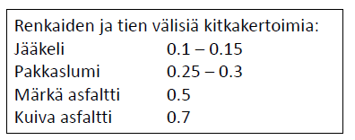
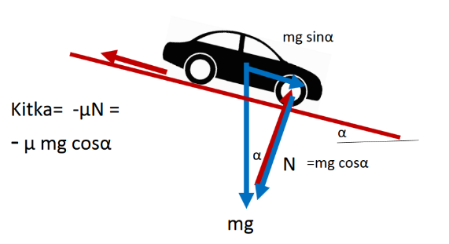
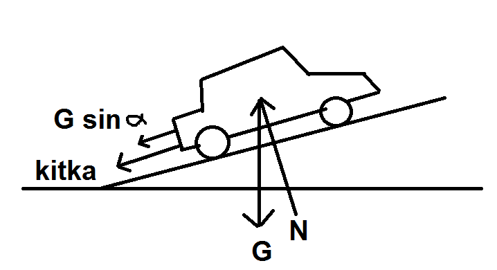

# Dynamiikkaa

Paikallaan pysyviin tai tasaisella nopeutta liikkuviin kappaleisiin liittyvissä ongelmissa tarvittiin Newtonin 1. lakia. Dynamiikka on fysiikan osa-alue, joka tarkastelee sitä, miksi ja millä tavalla kappaleet lähtevät liikkeelle. Tällaisissa ongelmissa hyödynnetään Newtonin 2. lakia.

Tarkastellaan muutamaa käytännönläheistä dynamiikan ongelmaa, jotka liittyvät mäkiin ja jarrutuksiin. Kun ajoneuvo jarruttaa, se on fysiikan mielessä kiihtyvässä liikkeessä, eli sen nopeus muuttuu. Siksi tarvitaan myös kiihtyvän liikkeen fysiikkaan liittyviä kaavoja.

Jarrutuksessa kiihtyvyys on peräisin renkaiden ja alustan välisestä kitkasta sekä pinnan kaltevuudesta:

- Kitkavoima $F_{\mu}=\mu N$ on kahden pinnan välillä vaikuttava, pinnan suuntainen voima, johon vaikuttaa pintojen laatu ja kappaleeseen kohdistuva pinnan tukivoima. Pintaparin vaikutusta kuvaa kitkakerroin $\mu$, josta on esimerkkejä taulukossa. Tukivoima $N$ riippuu kappaleen massasta, mahdollisista pystysuuntaisista voimista ja tason kaltevuudesta.

- Kaltevalla pinnalla painovoima kiihdyttää kappaletta alamäen suuntaan. Kiihtyvyys ei kuitenkaan ole niin suurta kuin suoraan alaspäin putoamisessa.

Tasaisella, alamäessä ja ylämäessä kitkavoima ja painovoima aiheuttavat eri suuruisen kokonaisvoiman. Kokonaisvoimasta seuraa Newtonin 2. lain mukainen kiihtyvyys. Sen jälkeen päästäänkin käyttämään kiihtyvän liikkeen laskukaavoja. Kiihtyvän liikkeen kaavoista tarvitaan kaksi yhtälöä:

- nopeusyhtälö $ v=v_0+at$, 
- paikkayhtälö $x=v_0 t+\frac{1}{2} at^2$,

joissa $v$ on loppunopeus, $v_0$ alkunopeus ja $t$ aika.

## Jarrutus tasaisella

Kun jarrutetaan tasaisella tiellä, niin jarrutuksen aikaansaava voima on renkaiden ja tien välinen kitkavoima. Kun kappale on tasaisella pinnalla eikä kappaleeseen kohdistu muista pystysuuntaisia voimia kuin painovoima ja alustan tukivoima, niin kitkavoiman suuruus on 

$F_{\mu}=\mu N=\mu mg$.

Koska auton oletetaan pystysuunnassa olevan paikallaan ja siten noudattavan Newtonin 1. lakia, riittää tarkastella Newtonin 2. lain avulla vaakasuuntaisia voimia. Lain mukaan voimien summa on yhtä suuri kuin auton massa $m$ kertaa auton kiihtyvyys $a$. Ainoa vaakasuuntainen voima on kitkavoima, ja koska se suuntautuu liikettä vastaan, merkitään se yhtälöön negatiivisena:

$-\mu mg=ma$, josta ratkeaa välittömästi $a=-\mu g$.

::::{admonition} Esimerkki

Kitkakerroin renkaan ja jäisen tien välillä on 0.20. Kuinka pitkä on jarrutusmatka pysähdykseen asti nopeudesta 85 km/h?

:::{admonition} Ratkaisu
:class: tip, dropdown

Kiihtyvyys on $a=-\mu g = -0.20\cdot 9.81~\frac{\text{m}}{\text{s}^2}=-1.962 ~\frac{\text{m}}{\text{s}^2}$.

Sijoitetaan tiedossa olevat luvut nopeus- ja paikkayhtälöön:

$0=\frac{85}{3.6}~\frac{\text{m}}{\text{s}}-1.962~\frac{\text{m}}{\text{s}^2}\cdot t$,

$x=\frac{85}{3.6}~\frac{\text{m}}{\text{s}}\cdot t - \frac{1}{2}\cdot 1.962 ~\frac{\text{m}}{\text{s}^2} \cdot t^2$

Nopeusyhtälöstä voi ratkaista jarrutusajan

$t=\frac{85}{3.6\cdot 1.962} ~\text{s} = 12.034 ~\text{s}$,

jonka sijoittamalla paikkayhtälöön saa

$x=\frac{85}{3.6}~\frac{\text{m}}{\text{s}}\cdot 12.034~\text{s} - \frac{1}{2}\cdot 1.962 ~\frac{\text{m}}{\text{s}^2} \cdot (12.034~\text{s})^2 = 142~\text{m}$.

Tehtävän voi ratkaista myös WolframAlphalla:

solve a=-0.2\*9.81, 0=85/3.6+a\*t, x=85/3.6\*t+0.5\*a\*t^2

Huomaa, että nopeus- ja paikkayhtälössä kiihtyvyyden edellä on plus (+) eikä miinus (-), sillä miinusmerkki on jo huomioitu kiihtyvyyttä laskettaessa.

:::

::::

## Jarrutus alamäessä

Alamäessä painovoima saa kappaleen kiihtyvään liikkeeseen. Kitkavoima puolestaan jarruttaa liikettä.

Tasolla, jonka kaltevuuskulma on $\alpha$, kappaleeseen vaikuttaa painovoima $G=mg$ suoraan alaspäin, pinnan tukivoima $N$ kohtisuoraan pintaa vastaan sekä pinnan suuntainen kitkavoima $F_{\mu}$. Kuvassa kitkan arvo on negatiivinen, sillä kitka kohdistuu liikesuuntaa vastaan.

Tukivoima on aina kohtisuorassa pintaa vastaan. Niinpä se ei ole yhtä suuri kuin painovoima, vaan se on yhtä suuri kuin se osuus painovoimasta, joka on pintaa vasten kohtisuorassa. Suorakulmaisen kolmion trigonometrian perusteella pinnan tukivoima on 

$N=mg \cos⁡{\alpha}$,

joten kitkavoiman suuruus on 

$\mu mg \cos {\alpha}$.

Painovoimasta kiihtyvyyttä alaspäin aiheuttaa vain se osa, joka on pinnan suuntainen. Tämäkin osa saadaan suorakulmaisen kolmion trigonometrian perusteella: pinnan suuntainen komponentti on 

$mg \sin{\alpha}$.

Liukuvan kappaleen kiihtyvyys selviää laskemalla näiden voimien summa, suunnat huomioiden, ja soveltamalla Newtonin 2. lakia samalla tavalla kuin tasaisella. Siis

$mg \sin{\alpha} - \mu mg \cos {\alpha} = ma$,

josta saadaan kiihtyvyys

$a= g \sin{\alpha} - \mu g \cos {\alpha} = g (\sin{\alpha}- \mu g \cos {\alpha} )$

Jos kiihtyvyys on negatiivinen, voidaan laskea jarrutusaika ja jarrutusmatka kiihtyvän liikkeen yhtälöistä. Jos kiihtyvyys on positiivinen, nopeus kasvaakin koko ajan. Tällainen tilanne voi olla toivottukin esimerkiksi laskettelurinteessä. Jos tällaisessa tilanteessa yritettäisiin laskea jarrutusaikaa ja -matkaa, vastaukseksi tulisi negatiivisia lukuja: joskus ollaan oltu paikallaan, mutta ei tulla enää olemaan!

::::{admonition} Esimerkki

Autoilija suorittaa lukkojarrutuksen alamäessä, jonka kaltevuuskulma on 3 astetta. Kitkakerroin on vain 0.1. Laske kiihtyvyys. Miten jyrkässä mäessä jarrutus olisi mahdollinen?

:::{admonition} Ratkaisu
:class: tip, dropdown

Kiihtyvyys on $a=9.81 ~\frac{\text{m}}{\text{s}^2} (\sin{3^{\circ}}-0.1 \cos⁡{3^{\circ}})=-0.47 ~\frac{\text{m}}{\text{s}^2}$.

Kokeilemalla laskukaavaan isompia kaltevuuskulman arvoja todetaan, että 6 asteen kaltevuuskulmalla kiihtyvyys saisi jo positiivisen arvon. 

WolframAlpha tulkitsee pienet kulmat radiaaneina. Kannattaa siis tarkistaa, onko se tulkinnut lukemat asteina, ja tarvittaessa vaihtaa asetus.

:::

::::

::::{admonition} Esimerkki

Laske auton jarrutusmatka 90 km/h nopeudesta 5 asteen alamäessä, kun kitkakerroin on 0.35.

:::{admonition} Ratkaisu
:class: tip, dropdown

Kiihtyvyys on $a=9.81 ~\frac{\text{m}}{\text{s}^2} (\sin{5^{\circ}}-0.35 \cos⁡{5^{\circ}}=-2.57 ~\frac{\text{m}}{\text{s}^2}$.

Sijoitetaan tiedossa olevat luvut nopeus- ja paikkayhtälöön:

$0=\frac{90}{3.6}~\frac{\text{m}}{\text{s}}-2.57~\frac{\text{m}}{\text{s}^2}\cdot t$,

$x=\frac{90}{3.6}~\frac{\text{m}}{\text{s}}\cdot t - \frac{1}{2}\cdot 2.57 ~\frac{\text{m}}{\text{s}^2} \cdot t^2$

Nopeusyhtälöstä voi ratkaista jarrutusajan

$t=\frac{90}{3.6\cdot 2.57} ~\text{s} = 9.73 ~\text{s}$,

jonka sijoittamalla paikkayhtälöön saa

$x=\frac{90}{3.6}~\frac{\text{m}}{\text{s}}\cdot 9.73~\text{s} - \frac{1}{2}\cdot 2.57 ~\frac{\text{m}}{\text{s}^2} \cdot (9.73~\text{s})^2 = 122~\text{m}$.

Tehtävän voi ratkaista myös WolframAlphalla:

solve a=9.81\*(sin(5)-0.35*cos(5)), 0=90/3.6+a\*t, x=90/3.6\*t+0.5\*a\*t^2

:::

::::

## Jarrutus ylämäessä

Ylämäessä auton liikettä hidastavat sekä kitka $\mu mg \cos {\alpha}$ että painovoiman tason suuntainen komponentti $mg \sin{\alpha}$. Kumpikin ovat liikesuunnan vastaisina negatiivisia. Newtonin 2. laki on siis:

$-mg \sin{\alpha} - \mu mg \cos {\alpha} = ma$,

josta saadaan kiihtyvyys

$a=-g(\mu \cos{\alpha}+\sin{\alpha})$.

::::{admonition} Esimerkki

Laske edellisen tehtävän jarrutusmatka, jos kyseessä on 5 asteen ylämäki.

:::{admonition} Ratkaisu
:class: tip, dropdown

Kiihtyvyys on $a=-9.81 ~\frac{\text{m}}{\text{s}^2} (\sin{5^{\circ}}+0.35 \cos⁡{5^{\circ}})=-4.28 ~\frac{\text{m}}{\text{s}^2}$.

Sijoitetaan tiedossa olevat luvut nopeus- ja paikkayhtälöön:

$0=\frac{90}{3.6}~\frac{\text{m}}{\text{s}}-4.28~\frac{\text{m}}{\text{s}^2}\cdot t$,

$x=\frac{90}{3.6}~\frac{\text{m}}{\text{s}}\cdot t - \frac{1}{2}\cdot 2.48 ~\frac{\text{m}}{\text{s}^2} \cdot t^2$

Nopeusyhtälöstä voi ratkaista jarrutusajan

$t=\frac{90}{3.6\cdot 2.57} ~\text{s} = 5.85 ~\text{s}$,

jonka sijoittamalla paikkayhtälöön saa

$x=\frac{90}{3.6}~\frac{\text{m}}{\text{s}}\cdot 5.85~\text{s} - \frac{1}{2}\cdot 4.28 ~\frac{\text{m}}{\text{s}^2} \cdot (5.85~\text{s})^2 = 73~\text{m}$.

Tehtävän voi ratkaista myös WolframAlphalla:

solve a=-9.81*(sin(5)+0.35*cos(5)), 0=90/3.6+a\*t, x=90/3.6\*t+0.5\*a\*t^2

:::

::::

:::{admonition} Huomautus
:class: tip, dropdown

Esimerkkien ja kokemustenkin perusteella lienee selvää, että jarrutusmatkat ovat lyhimmistä pisimpään seuraavassa järjestyksessä: ylämäessä, tasaisella ja alamäessä. 

Sekä ala- että ylämäen laskukaavat toimivat myös tasaisella tiellä. Tällöin kaltevuuskulma on 0 astetta. Tälle kulmalle pätee $\cos{0^{\circ}}=1$ ja $\sin{0^{\circ}}=0$. Sijoittamalla nämä arvot kumpikin kaava sievenee muotoon $a=-\mu g$.

Mitähän tapahtuisi, jos kulma olisikin 90 astetta? Kokeile sijoittamalla ala- ja ylämäen kaavoihin $\cos{90^{\circ}}$ ja $\sin{90^{\circ}}
$!
:::
 
## Päästäänkö mäki ylös?

Tarkastellaan vielä lopuksi, miten kitka ja mäen kaltevuus vaikuttavat siihen, miten mäkiä pääsee kiipeämään ylös. Ylämäkeen liikuttaessa kiihtyvyyttä ylöspäin aiheuttaa kitkavoima renkaiden - tai vaikka kenkien - ja pinnan välillä. Painovoima taas aiheuttaa kiihtyvyyttä alaspäin eli käytännössä taaksepäin. Oletetaan, että riittäisi päästä mäkeä ylös tasaisella nopeudella. Tällöin Newtonin 1. lain mukaisesti tulisi olla:

$\mu mg \cos{\alpha} - mg \sin{\alpha} = 0$.

Jaetaan yhtälö massalla ja putoamiskiihtyvyydellä, jolloin se muuttuu muotoon

$\mu \cos{\alpha} - \sin{\alpha} = 0$.

Nyt yhtälöstä ratkeaa

$\mu = \frac{\sin{\alpha}}{\cos{\alpha}}$ eli lyhyemmin $\mu = \tan{\alpha}$.

Liikennemerkeissä mäen kaltevuus on kerrottu prosentteina. Luku tarkoittaa sitä, kuinka paljon mäki nousee ylöspäin suhteessa vaakasuuntaiseen siirtymään. Kyseinen lukema, desimaalilukuna ilmaisuna, on täsmälleen sama asia kuin kaltevuuskulman tangentti (eli pysty- ja vaakasuoran kateetin suhde). Niinpä jos mäen jyrkkyydeksi ilmoitetaan liikennemerkissä 7 %, tarkoittaa se samaa kuin mäki, jonka kaltevuuskulman tangentti on 0.07. Tällainen mäki päästään periaatteessa ylös, jos kitkakerroin on vähintään 0.07.

 
::::{admonition} Esimerkki

a) Kuinka suuren pitää renkaan ja tien välisen kitkakertoimen olla, jotta päästäisiin ylös mäki, jonka kaltevuus on 8 astetta?

b) Kuinka jyrkän mäen voi päästä ylös, kun kitkakerroin on 0.1?

:::{admonition} Ratkaisu
:class: tip, dropdown

a) $\mu=\tan{8^{\circ}}=0.14$, joka vastaa 14 % mäkeä

b) $\alpha=\arctan{0.1}=5.7^{\circ}$ tai prosentteina ilmaistuna 10 %

:::

::::