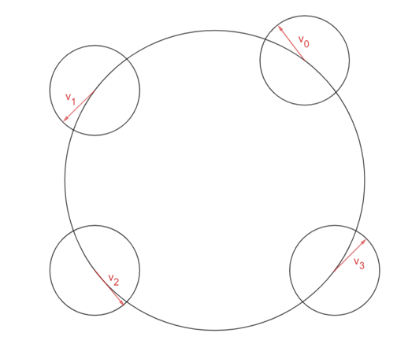
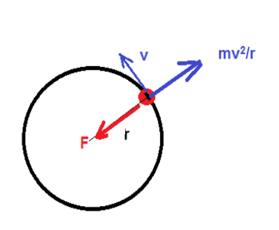

# Kiihtyvyys ja voimat

Ympyräradalla liikkuvan kappaleen suunta muuttuu koko ajan. Tällöin kappale on kiihtyvässä liikkeessä, vaikka sen etenemisnopeus radalla olisikin koko ajan sama. Jos kiihtyvyyttä kuvataan vektorina, se suuntautuu koko ajan ympyrän keskipisteeseen. Siksi sitä nimitetään keskeiskiihtyvyydeksi. Keskeiskiihtyvyys $a$ tarkoittaa kyseisen kiihtyvyysvektorin suuruutta. Se lasketaan kaavalla 

$a=\frac{v^2}{r}$

:::{admonition} Perustelu
:class: tip, dropdown

Kuvassa on esitetty nopeusvektorin suunta hetkillä 0, 1, 2 ja 3. Kierroksen kuluttua vektori osoittaa taas samaan suuntaan kuin hetkellä 0.

Kiihtyvyys määritellään: nopeuden muutos jaettuna muutokseen kuluneella ajalla. Nopeuden muutos on nyt nopeusvektorin kärjen kulkema matka kierroksen aikana. Eräs määritelmä matkalle ympyrän kehää pitkin on: kierretty kulma kertaa ympyrän säde. Kun kierretään iso ympyrä kerran, niin nopeusvektori kiertyy täyden kulman $2\pi$. Vektorin pituus on $v$. Kokonaisuudessaan nopeusvektorin kärki liikkuu siis omalla ympyrällään kierroksen aikana $2\pi$. Aikaa kierroksen aikana kului $T=\frac{2\pi r}{v}$. Siis kiihtyvyys on 

$a=\frac{2\pi v}{\frac{2\pi r}{v}} = 2\pi v \cdot \frac{2}{2\pi r} =\frac{v^2}{r}$
:::

::::{admonition} Esimerkki

Millä nopeudella pitäisi liikkua ympyräradalla, jotta saavutettaisiin noin yhden $g$:n suuruinen keskeiskiihtyvyys, jos ympyräradan säde on a) 20 m, b) 80 m?

:::{admonition} Ratkaisu
:class: tip, dropdown

Ratkaistaan nopeus yhtälöstä $a=\frac{v^2}{r}$, jolloin saadaan $v=\sqrt{ar}$. Sijoitetaan kiihtyvyyden paikalle $9.81~\frac{\text{m}}{\text{s}^2}$:

a) $v=\sqrt{9.81~\frac{\text{m}}{\text{s}^2}\cdot 20~\text{m}} = 14~\frac{\text{m}}{\text{s}} \approx 50~\frac{\text{km}}{\text{h}}$

b) $v=\sqrt{9.81~\frac{\text{m}}{\text{s}^2}\cdot 80~\text{m}} = 28~\frac{\text{m}}{\text{s}} \approx 100~\frac{\text{km}}{\text{h}}$

:::

::::

## Keskeisvoima ja keskipakovoima

Kappale pysyy ympyräradalla vain, jos jokin voima pitää sitä radalla. Tätä voimaa kutsutaan keskeisvoimaksi. Keskeisvoima voi olla esim. narun jännitysvoima, tien ja renkaan välinen kitkavoima, Auringon ja planeetan välinen painovoima, planeetan ja Kuun välinen painovoima...

Newtonin 2. lain perusteella keskipisteeseen päin suuntautuva voima on kappaleen massan ja keskeiskiihtyvyyden tulo, siis

$F=ma=\frac{mv^2}{r}$.

Jos voima lakkaa vaikuttamasta, niin kiihtyvyyskin lakkaa, jolloin kappale ei enää käänny radan mukaisesti. Se poistuu ympyräradalta sinne suuntaan, jonne oli voiman lakkaamisen hetkellä menossa. Suunta on matematiikan termein ilmaistuna ympyrän tangentti. Näin tapahtuu esimerkiksi silloin, kun moukarinheittäjä vauhdinoton jälkeen irrottaa otteensa moukarin ketjusta.

Laskuissa käytetään avuksi keskipakovoiman käsitettä. Keskipakovoima ei ole varsinaisesti oikea voima. Keskipakovoiman ajatellaan suuntautuvan ympyräradalta poispäin, vastakkaiseen suuntaan kuin ympyrän säde. Ajatus käsitteen taustalla on se, että kappale on (sivusuunnassa) paikallaan, jolloin on oltava joku keskeisvoimalle vastakkainen, mutta yhtä suuri voima. Oikeastaan tällöin kuvataan kappaleen liikettä kappaleen mukana kulkevassa koordinaatistossa, jossa kappale on paikallaan. Keskipakovoima on suuruudeltaan sama kuin keskeisvoima.

Oletetaan, että kappaletta pitää ympyräradalla keskeisvoima $F$. Vastakkaiseen suuntaan vaikuttaa keskipakovoima. Newtonin 1. lain mukaisesti voidaan siis kirjoittaa

$F=\frac{mv^2}{r}$.

Sijoittamalla voiman $F$ paikalle sopiva laskukaava voidaan nyt ratkaista esimerkiksi tämän kaltaisia ongelmia: Miten kaukana maapallo kiertää Aurinkoa? Miten suuri pitää olla tien ja renkaiden välisen kitkavoiman, jotta auto pysyy kaarteessa tiellä?

::::{admonition} Esimerkki

Maapallon ja auringon välinen painovoima lasketaan kaavalla $F=G\cdot \frac{m\cdot M}{r^2}$, missä $m=5.97\cdot 10^{24}~\text{kg}$ on maapallon massa ja $M$ on auringon massa. Suure $G=6.67\cdot 10^{-11}~\frac{\text{m}^3}{\text{kg}\text{s}^2}$ on ns. gravitaatiovakio. Laske auringon massa, kun tiedetään, että maapallo kiertää 150 miljoonan kilometrin etäisyydellä auringosta yhden kierroksen vuodessa.

:::{admonition} Ratkaisu
:class: tip, dropdown

Sijoitetaan voiman paikalle painovoiman lauseke ja ratkaistaan massa $M$:

$\frac{GmM}{r^2}=\frac{mv^2}{r}$

$\frac{GM}{r^2}=\frac{v^2}{r}$

$GM=v^2r$

$M=\frac{v^2 r}{G}$

Sijoitetaan $v=\frac{2\pi r}{T}$:

$M=\frac{4 \pi^2 r^2}{T^2}\frac{r}{G}$

$M=\frac{4\pi^2 r^3}{T^2 G}$

$M=\frac{4\pi^2 \cdot(150000000000~\text{m})^3}{(365\cdot 24\cdot 60 \cdot 60 ~\text{s})^2 \cdot 6.67\cdot 10^{-11}~\frac{\text{m}^3}{\text{kg}\text{s}^2}}$

$M=2.0\cdot 10^{30}~\text{kg}$

:::

::::